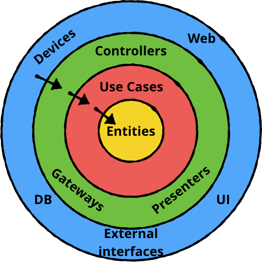
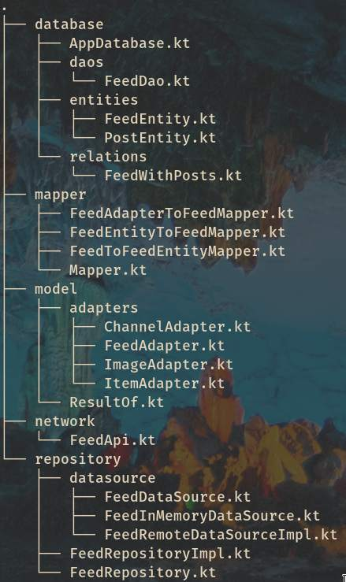
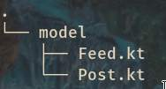
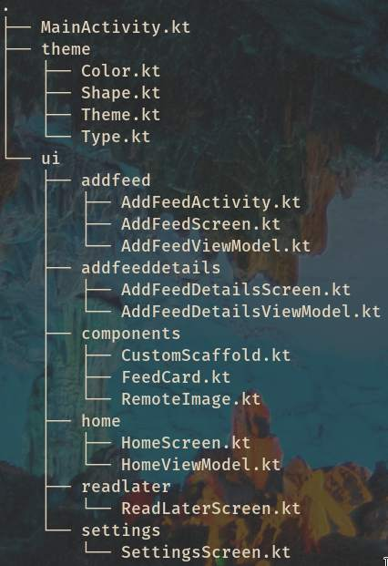

# boat
Um leitor para RSS Feeds para Android.

**Demo**

Para o app em questao, escolhi utilizar ideias da Arquitetura Limpa de Robert C. Martin, que preza por organizar componentes em niveis guiados pelo o quao estavel um componente e. Por exemplo: Os componentes dentro do nivel do dominio serao os mais estaveis da aplicacao, pois varias classes irao depender deles.

A organizacao das pastas ficou da seguinte forma:

E importante dizer que, pelo curto periodo de tempo, nao dividi os niveis em uma arquitetura multi-modulo, a qual seria extremamente util para o encapsulamento dos componentes.

## Nivel data

Nesse nivel, o conceito principal desse nivel que agregou para a organizacao da arquitetura do projeto, foi a aplicacao do "Single Source of Truth" atraves do padrao Repository. Dessa forma, conseguimos ter um unico contrato que gerencia as operacoes sem depender de implementacoes de banco de dados ou APIs, seguindo o conceito de arquitetura Plug-In.

Perceba tambem que temos 2 data sources diferentes `FeedInMemoryDataSource` e `FeedRemoteDataSource`. Isso evidencia ainda mais o quao agnostico de implementacoes nosso repository esta.

## Nivel domain

No nivel de dominio, foram listados apenas os models, porem, no futuro seria interessante adicionar classes para tratar casos de uso da aplicacao, para facilitar a testabilidade e a separacao de reponsabilidadades, uma vez que essas classes seriam responsaveis por operacoes especificas da aplicacao.

## Nivel presentation

Esse nivel e responsavel por tudo que e mostrado ao usuario final. Todos os componentes de UI estao nesse nivel e nele, foi utilizado a arquitetura MVVM junto ao Jetpack Compose, o novo toolkit de UI para desenvolver interfaces no android de maneira declarativa. E importante salientar que esse toolkit ainda esta em suas versoes iniciais, logo, possui algumas limitacoes, como por exemplo, o fluxo de navegacoes na app.

Perceba que foi utilizado uma unica Activity para as telas principais do app (Home, Read Later e Settings). E para fluxos especificos, a proposicao foi iniciar activities novas com seus respectivos fluxos de navegacoes (assim como a MainActivity).

## Bibliotecas utilizadas

- Dagger + Hilt para injecao de dependencias;
- Retrofit para acesso a internet;
- Room para persistencia de dados;
- Simple XML para mapeamento de dados via XML;
- Picasso para carregamento de imagens;
- E alguns pacotes de UI para utilizar junto ao Jetpack compose.

Foi utilizado uma feature do gradle para facilitar o gerenciamento de dependencias e suas versoes. Perceba que tem um module `buildSrc` no projeto onde fazemos todo esse gerenciamento.

## Coming soon

- Unit tests utilizando JUnit e testes de UI utilizando o Espresso.
