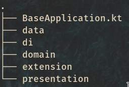

# boat
A RSS Feed Reader for Android.

**Demo**

For the app in question, I chose to use ideas of Robert C. Martin's clean architecture, which values organizing components in levels guided by how stable a component is. For example, components within the level of domain will be the most stable of the application, as several classes will depend on them.

This is the project's file tree:

It's important to mention that a multi-module architecture was not used to separate the layers, but it would be super useful to encapsulate components.

## Data layer

At this layer, the main concept that added to the organization of the project architecture was the application of the "Single Source of Truth" through the repository standard. In this way, we have been able to have a single contract that manages operations without depending on database or APIs implementations, following the concept of plug-in architecture.

Also note that we have 2 Date Different Sorces `FeedinMemorydatasource` and `FeedRemoteDataSource`. This further highlights the agnostic of implementations our repository is.

## Domain layer 

At domain layer, only models were listed, but in the future it would be interesting to add classes to treat cases of application use, to facilitate the will and the separation of reponsabilidades, as these classes would be responsible for specific application operations.

## Presentation Layer

This layer is responsible for everything that is shown to the final user. All UI components are in this layer and it was used the MVVM architecture with JetPack Compose, the new UI Toolkit to develop Android interfaces in a declarative way. It is important to point out that this Toolkit is still in its initial versions, so it has some limits, such as the flow of navigacations in the app.

Note that a single activity was used for the main screens of the app (Home, Read Later and Settings). And for specific flows, the proposition was to start new activities with their respective navigation flows (as well as mainactivity).

## Libraries used

- Dagger + Hilt for dependency injection;
- Retrofit for network requests;
- Room for data persistence;
- Simple XML for XML data mapping;
- Picasso for image loading;
- And some UI packs to use with Jetpack Compose.

A gradle feature was used to facilitate the dependencies management and its versions. Note that you have a module buildSrc in the project where we do all this management.

## Coming soon

- Unit tests using JUnit e UI tests using Espresso.
- Implement post listing and reading (core functionality of application).
